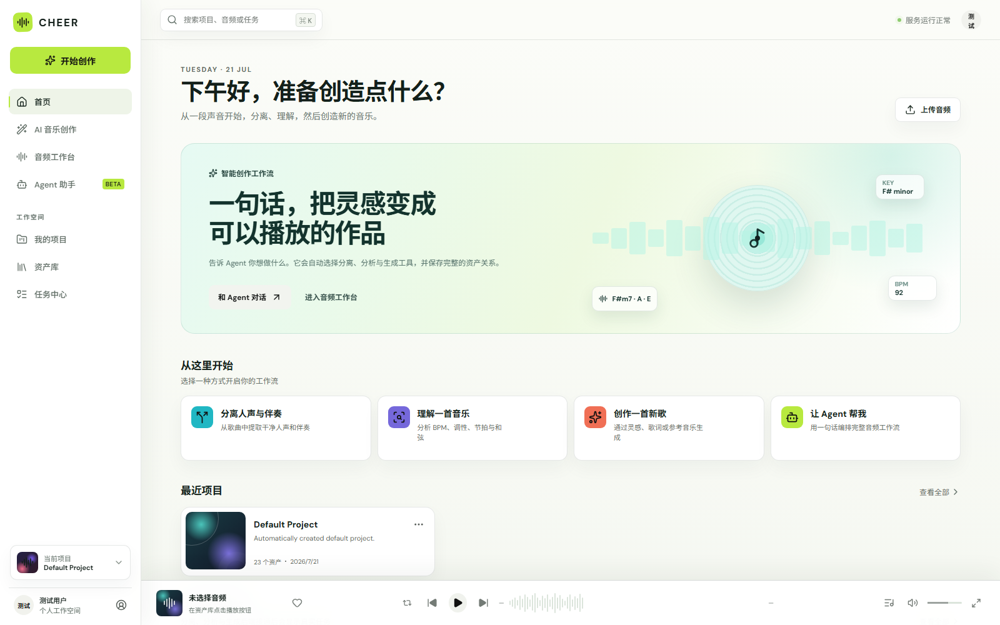
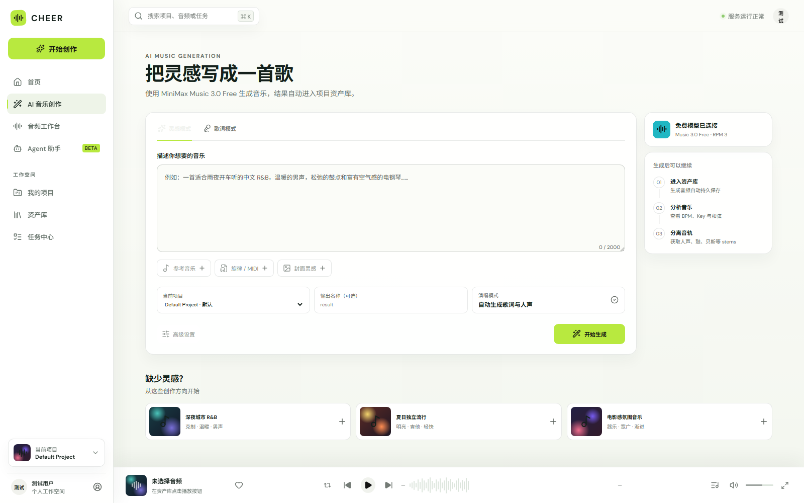
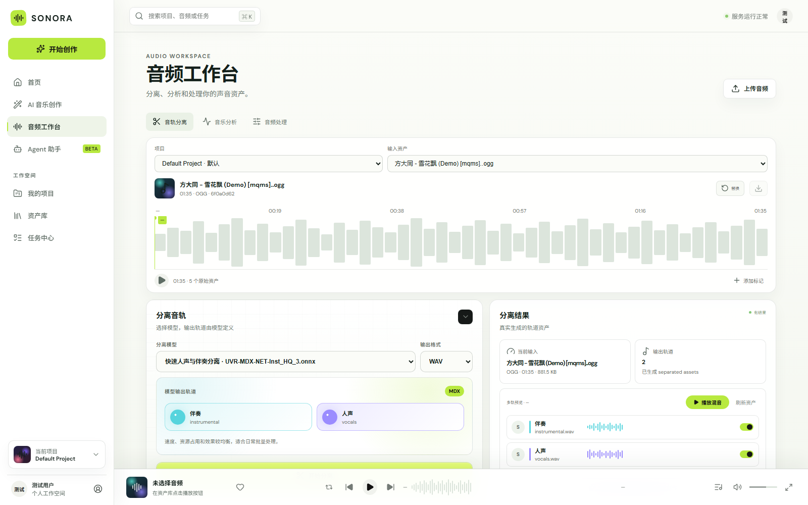
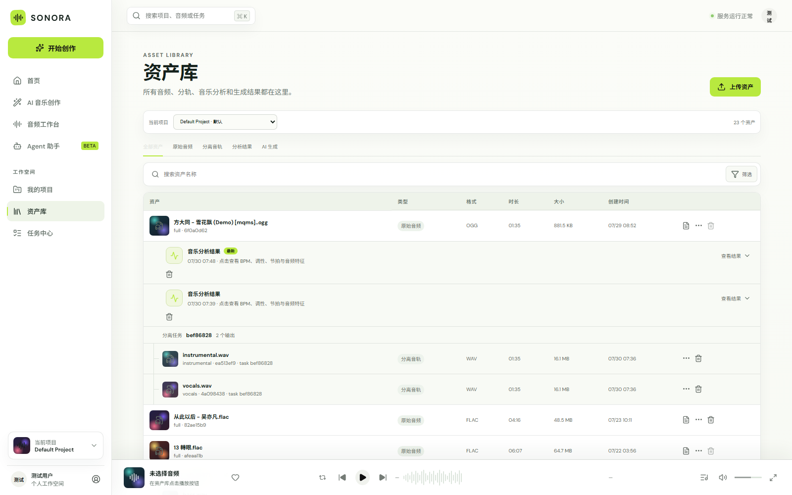
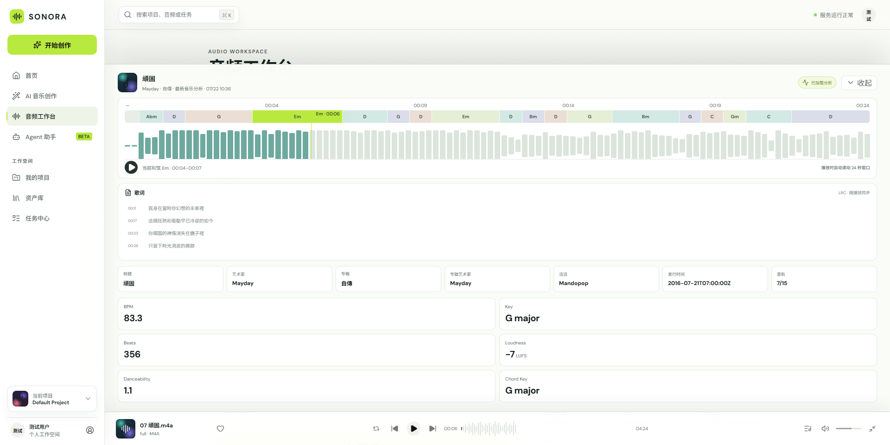
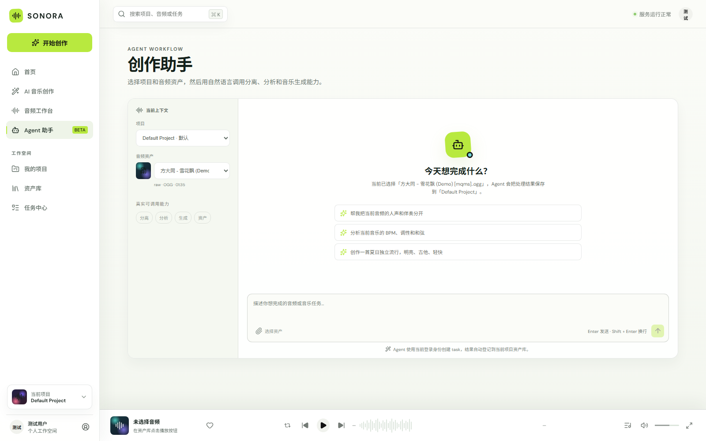

# SONORA Web

SONORA 音频智能创作平台的统一 Web 前端。它把用户、项目、音频资产、音轨分离、
音乐分析、AI 音乐生成和 Agent 编排放在同一个工作空间中，并通过 `asset_id` 与
持久化 `task` 串联各个后端服务。

English documentation: [README_EN.md](README_EN.md)



## 已实现功能

### 1. 用户与项目工作空间

- 使用 `audio-assets` 完成用户注册、JWT 登录和登录状态恢复。
- 新用户自动获得 Default Project，也可以创建多个独立项目。
- 项目作为音频、任务和衍生资产的归属边界，所有页面均可切换当前项目。
- 页面根据本地时间在日间与夜间主题之间自动切换。

### 2. AI 音乐生成

- 已接入 `music-generation` 和 MiniMax Music。
- 支持纯灵感描述与歌词模式，可以指定结果名称、是否纯音乐、采样率、码率和输出格式。
- 前端提交异步生成任务并展示进度，完成后将音乐登记到当前项目资产库并立即播放。
- 当前默认使用 `music-3.0-free`；实际可用模型由后端能力接口决定。



### 3. 音频工作台

工作台围绕当前项目和输入 `asset_id` 工作，包含统一播放器、真实波形区域和以下两条
已接通流程：

- **音轨分离**：读取后端推荐模型，模型决定输出轨道；支持 WAV、FLAC、MP3，显示
  实时进度并在刷新或切换页面后恢复任务。
- **多轨预览**：输出轨道支持 Solo，以及通过轨道开关加入或退出同步混音播放。
- **音乐分析**：提交 Essentia + beat_this 分析任务，展示 BPM、Key、节拍数、响度、
  可舞性、和弦调性、元数据、歌词和其他结构化指标。
- **波形与和弦时间轴**：播放时同步滚动当前和弦；支持局部窗口与完整时间线查看。



### 4. 资产库与播放

- 上传原始音频，并可为音频附加或替换 `.lrc` 歌词文件。
- 按原始音频组织分离、分析和生成结果，避免衍生资产无关联地平铺展示。
- 支持原始音频、分轨和生成音乐的统一底部播放器。
- 分析结果不再只显示 `analysis.json` 文件名，可以展开查看指标、时间轴和歌词。
- 删除资产时同时调用数据库与 MinIO 清理逻辑，并阻止产生孤儿资产的危险删除。



从资产库或工作台播放一个已有分析结果的音频后，可以展开底部播放器：界面会自动读取
该音频最新的分析资产和关联歌词，在播放过程中同步展示 24 秒波形窗口、当前和弦、
LRC 歌词、音乐标签以及核心分析指标。



### 5. 任务中心

- 从 `audio-assets.task` 加载上传、分离、分析和生成任务。
- 展示任务类型、状态、进度、创建时间和产物数量。
- 对仍在运行的分离和分析任务补充查询队列实时状态；队列记录过期后仍以 SQL 任务为准。

### 6. Agent 创作助手

- 已接入真实 `audio-openai-agent` SSE 流式接口，不是固定回复或 mock 页面。
- 用户可选择当前项目和音频资产，再使用自然语言发起分离、分析、生成或组合工作流。
- 界面实时展示 Agent 选择和执行的工具步骤。
- JWT 只由前端转发给 Agent 后端，不会显示在聊天消息中；结果仍进入当前项目的任务中心
  和资产库。



## 系统交互

| 服务 | 默认地址 | 前端使用范围 |
|---|---|---|
| `audio-assets` | `http://127.0.0.1:8030/api` | 用户/JWT、项目、上传、资产、歌词、任务、播放地址和删除 |
| `audio-separator` | `http://127.0.0.1:8001/api/audio-processing` | 推荐模型、分离任务、进度和分轨产物 |
| `audio-analyzer` | `http://127.0.0.1:8020/api/audio-analysis` | 分析任务、统一结果、波形、和弦、歌词与指标 |
| `audio-openai-agent` | `http://127.0.0.1:8010/api` | JWT 上下文、SSE 对话和跨服务工具编排 |
| `music-generation` | `http://127.0.0.1:8050/api/music-generation` | MiniMax 音乐生成、任务轮询和生成资产 |

```text
浏览器
  ├── JWT / project / asset / task ──► audio-assets
  ├── asset_id ──────────────────────► audio-separator
  ├── asset_id ──────────────────────► audio-analyzer
  ├── project_id + prompt ───────────► music-generation
  └── JWT + project_id + asset_id ───► audio-openai-agent
                                         └── 编排上述底层服务
```

分离、分析和生成都是异步任务。前端在页面内展示队列进度，同时以 `audio-assets` 中的
SQL 任务和资产记录作为持久事实来源。

## 技术栈

- React 19
- TypeScript
- Vite
- React Router
- Lucide Icons
- 原生 Fetch + Server-Sent Events
- Conda 环境：`audio-frontend`

## 本地运行

### 1. 准备前端环境

已有 `audio-frontend` 环境时直接安装依赖：

```bash
conda run -n audio-frontend npm install
```

还没有环境时可以创建：

```bash
conda create -n audio-frontend -c conda-forge nodejs=22 -y
conda run -n audio-frontend npm install
```

### 2. 配置后端地址

```bash
cp .env.example .env.local
```

可用变量：

```env
VITE_ASSETS_API=http://127.0.0.1:8030/api
VITE_SEPARATOR_API=http://127.0.0.1:8001/api/audio-processing
VITE_ANALYZER_API=http://127.0.0.1:8020/api/audio-analysis
VITE_AGENT_API=http://127.0.0.1:8010/api
VITE_GENERATION_API=http://127.0.0.1:8050/api/music-generation
```

### 3. 启动

```bash
./scripts/start_dev.sh
```

浏览器访问 `http://127.0.0.1:8040`。

需要服务在 tmux 中持续运行：

```bash
./scripts/tmux_dev.sh
tmux attach -t audio-platform-web
```

## 质量检查

```bash
conda run -n audio-frontend npm run lint
conda run -n audio-frontend npm run build
```

## 当前边界

- “音频处理”标签仍是后续扩展入口，格式转换、响度标准化和降噪尚未全部接入。
- AI 创作页的参考音乐、旋律/MIDI 和封面灵感入口目前禁用，等待对应后端能力。
- Agent 组合工作流目前依赖各后端异步任务；生产环境还需要完善统一部署、监控与恢复策略。
